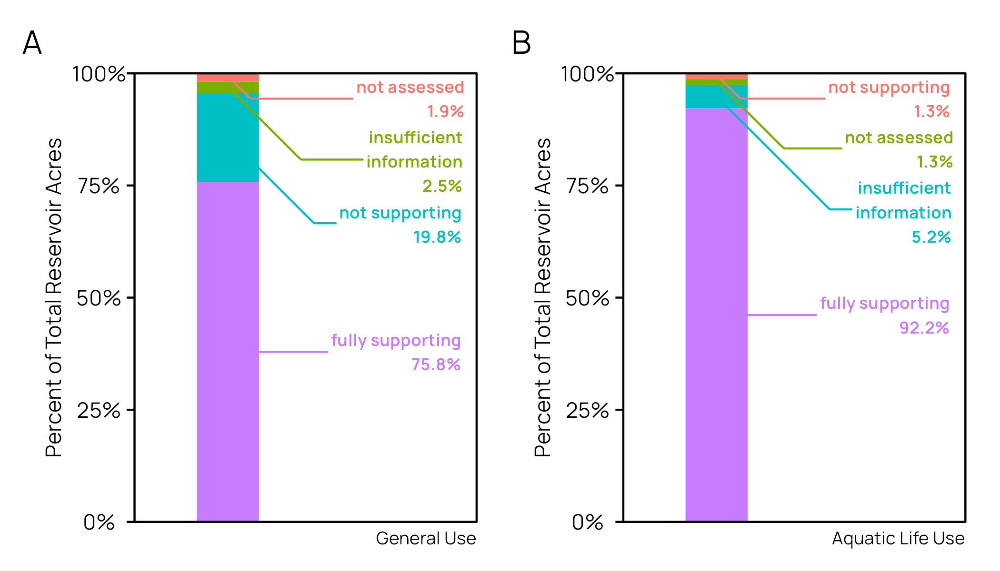
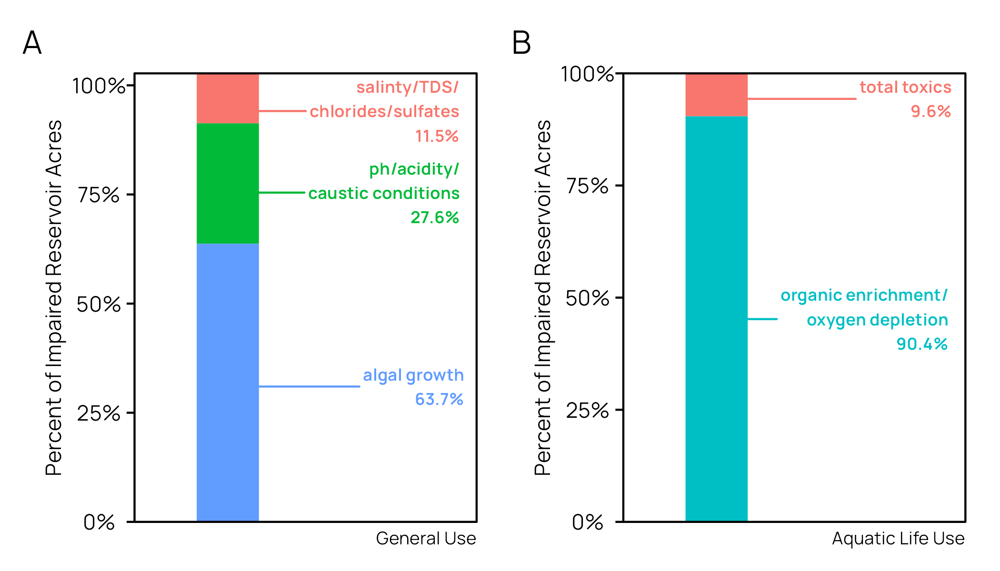
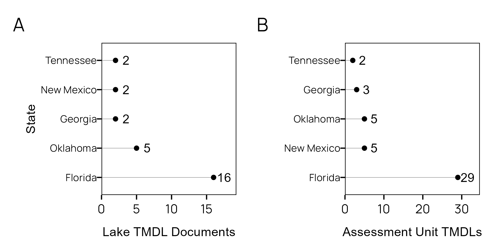
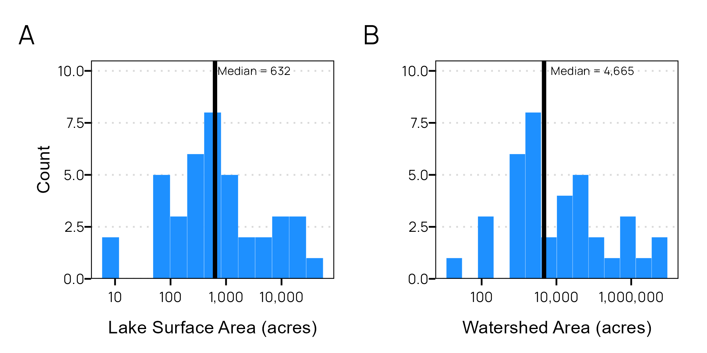
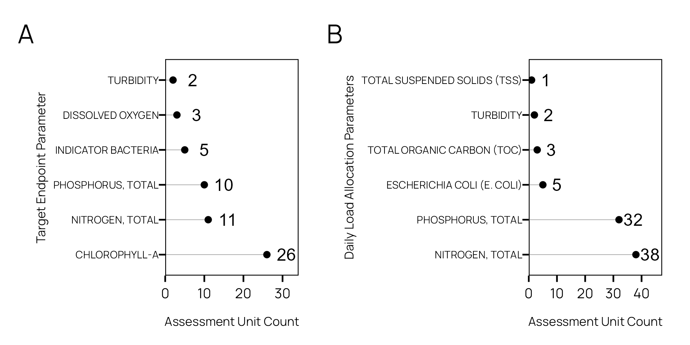
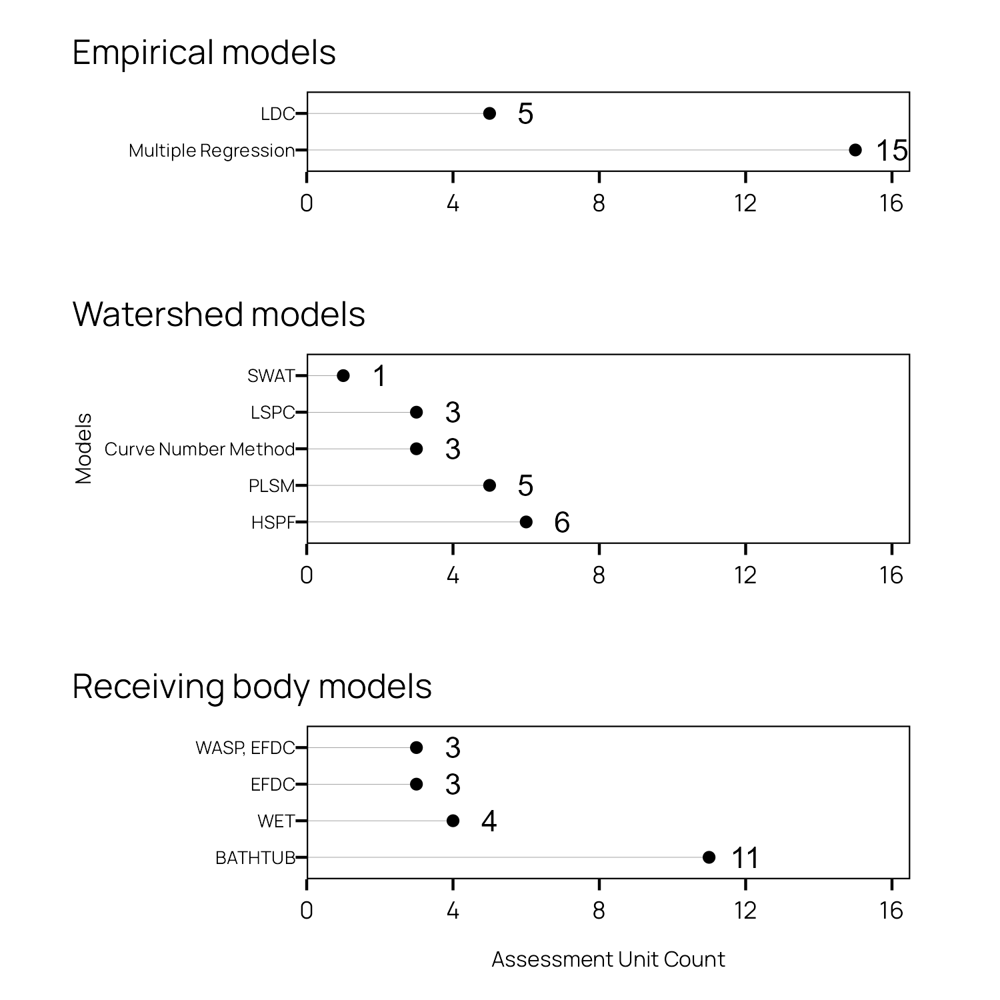
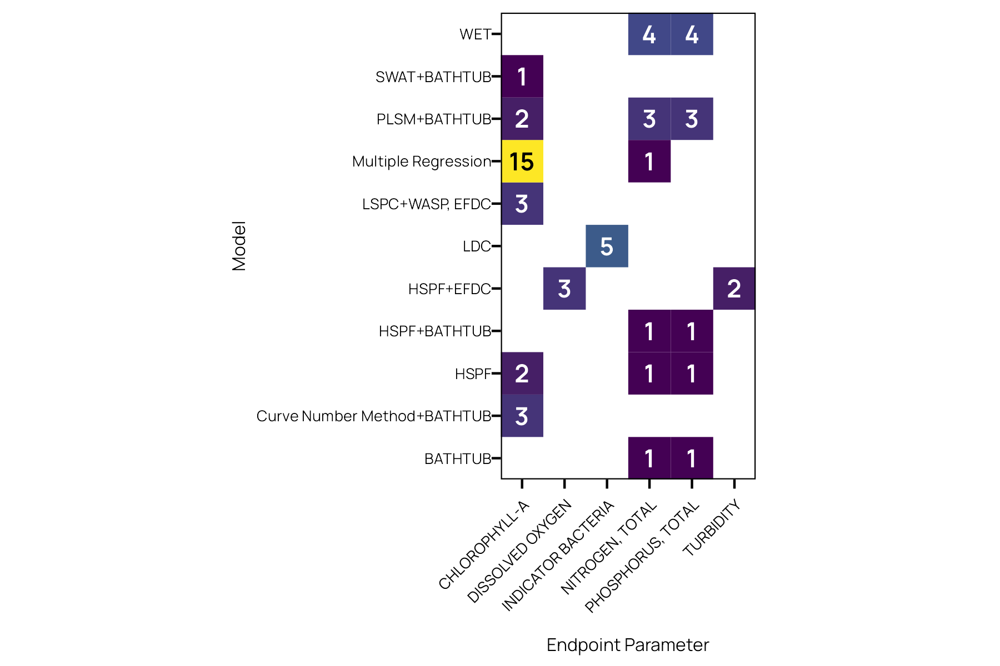

```{r setup, include=FALSE}
## load libraries
library(officer)
library(officedown)
library(flextable)
library(ftExtra)
library(ragg)

library(dplyr)
library(stringr)
library(ggplot2)
library(readr)
library(tidyr)

## this sets our default code chunk options
knitr::opts_chunk$set(dev = "ragg_png",
                      echo = FALSE,
                      ## figure chunk options
                      fig.cap = TRUE,
                      fig.width = 6)

```


Texas Water Resources Institute

Texas A&M AgriLife

College Station, TX

TR-ABCD


This project was funded by the Texas Commission on Environmental Quality.


```{r}
## leave in, starts new word document section
## after table of abbreviations
block_section(prop_section(type = "nextPage"))
```

::: {custom-style="Unnumbered Heading 1"}

Table of Contents

:::

<!---BLOCK_TOC--->

::: {custom-style="Unnumbered Heading 1"}

Table of Figures

:::

<!---BLOCK_TOC{seq_id: 'fig'}--->

::: {custom-style="Unnumbered Heading 1"}

Table of Tables

:::

<!---BLOCK_TOC{seq_id: 'tab'}--->

::: {custom-style="Unnumbered Heading 1"}

Abbreviations

:::


```{r}
## leave in, ends word document section
## after table of abbreviations
footer_default <- block_list(fpar(run_word_field(field = "PAGE"),
                                  fp_p = fp_par(text.align = "center")
                                  )
                             )
## can we move the page number on landscaped pages to portrait orientation?
footer_side <- block_list(fpar(run_word_field(field = "PAGE"),
                               fp_p = fp_par(text.align = "left")))

block_section(prop_section(type = "nextPage"))
```


# Introduction

States are required to identify water bodies that do not meet designated water
uses under Section 303(d) of the Clean Water Act. Total Maximum Daily Loads 
(TMDLs) must be developed for pollutants causing the impairment. 
TMDLs designate an allowable daily allowable pollutant load that can be 
discharged to the waterbody and continue to meet criteria for designated uses. 
Corresponding TMDL Implementation Plans (I-Plans) are developed to identify 
pollutant load reductions required to meet TMDLs and a schedule for 
the implementation of management measures (voluntary actions) and control 
actions (regulated or permitted requirements) that will achieve the required 
load reductions.


Since the mid-2000's addressing recreational impairments caused by excessive 
fecal indicator bacteria, primarily occurring in streams and rivers, has 
been the priority for the State of Texas's water quality planning efforts.
Under this priority, the state convened a Bacteria TMDL Task force to provide 
guidance and consensus among major stakeholders in the planning process for 
water quality planning approaches [@jonesBacteriaTotalMaximum2009]. 
The outcomes of this process included a unified approaches for prioritizing 
impaired waterbodies, determining sources of impairments, and developing load 
reductions in an efficient and scientifically robust manner.
These outcomes facilitated the rapid expansion of TMDL planning efforts in the 
state [@schrammTotalMaximumDaily2022].

Additional progress towards water quality planning and meeting Clean Water Act 
requirements will require an expanded focus beyond recreational impairments in 
streams and rivers.
As of the 2024 version of the Texas Integrated Report on Water Quality, 301,419 
acres (19.8% of total acres) of reservoirs are categorized as as impaired for 
"General Use"; 14,768 acres (1.2% of total reservoir acres) are categorized 
impaired for "Aquatic Life Use" [@epaAssessmentTotalMaximum2025, Figure \@ref(fig:general)]. 
Of the reservoir area impaired for "General Use", 192,005 acres (63%) list 
excessive algae as the reason for impairment (Figure \@ref(fig:general2)A).
Low dissolved oxygen is listed as the reason for 13,354 (90%) of the 
reservoir acres impaired for "Aquatic Life Use" (Figure \@ref(fig:general2)B). 
Currently, 11 lakes in Texas have TMDLs and corresponding Implementation Plans
and an additional four lakes have Watershed Protection Plans
[@tceqTrophicClassificationTexas2024, Table \@ref(tab:lkplans)]. 


```{r general, fig.cap='Classification status for "general use" (A) and "aquatic life use" (B) in Texas reservoirs by percent of acres [@epaAssessmentTotalMaximum2025].', fig.alt="Alternative text for screen readers", fig.width=7, fig.height=4, fig.dpi=300}

```

```{r general2, fig.cap='Cause of impairment for "general use" (A) and "aquatic life use" (B) impaired Texas reservoirs by percent of impaired acres [@epaAssessmentTotalMaximum2025].', fig.alt="Alternative text for screen readers", fig.width=7, fig.height=4, fig.dpi=300}

```


```{r tab.cap='Texas reservoirs with existing TMDLs or WPPs.', tab.id='lkplans'}

flextable(
  tibble(Name = c("Lake O’ the Pines",
                  "E.V. Spence Reservoir",
                  "Lake Austin",
                  "Lake Worth",
                  "Lake Houston",
                  "Aquilla Reservoir",
                  "Mountain Creek Lake",
                  "Lake Como",
                  "Fosdic Lake",
                  "Echo Lake",
                  "Donna Reservoir",
                  "Lake Arlington",
                  "Lake Granbury",
                  "Lake Lavon",
                  "Joe Pool Lake",
                  "Bois d’Arc Lake/Lake Bonham"),
         Action = c(rep("TMDL, I-Plan", 11),
                    rep("WPP", 5)),
         Impairment = c("Dissolved Oxygen",
                        "TDS and Sulfate",
                        "Dissolved Oxygen",
                        "Fish Consumption Advisory",
                        "Indicator Bacteria",
                        "Atrazine",
                        "Fish Consumption Advisory",
                        "Fish Consumption Advisory",
                        "Fish Consumption Advisory",
                        "Fish Consumption Advisory",
                        "Fish Consumption Advisory",
                        "Chlorophyll-a, Nitrate",
                        "Indicator Bacteria",
                        "Indicator Bacteria",
                        "Nitrate",
                        "Indicator Bacteria, Nitrate, Total Phosphorus, Chlorophyll-a"),
         `Target Parameter(s)` = c("Total Phosphorus",
                                   "Chloride, Sulfate, TDS",
                                   "Dissolved Oxygen",
                                   "PCBs",
                                   "E. coli",
                                   "Atrazine",
                                   "Chlordane, DDT, DDD, DDE, Dieldrin, Heptachlor epoxide, and PCBs",
                                   "Chlordane, DDT, Dieldrin, and PCBs",
                                   "Chlordane, DDT, Dieldrin, and PCBs",
                                   "PCBs",
                                   "PCBs",
                                   "Nutrients",
                                   "E. coli",
                                   "E. coli",
                                   "TKN and NOx",
                                   "E. coli, Nitrate, Total Phosphorus"))
  ) |> 
  set_table_properties(layout = "autofit") |> 
  mk_par(j = "Target Parameter(s)", i = ~`Target Parameter(s)` == "E. coli",
         value = as_paragraph(as_i("E. coli"))) |> 
    mk_par(j = "Target Parameter(s)", i = ~`Target Parameter(s)` == "E. coli, Nitrate, Total Phosphorus",
         value = as_paragraph(as_i("E. coli"), ", Nitrate, Total Phosphorus"))

```

Unlike the tiered approach identified by the Bacteria TMDL Task Force,
a unified approach for addressing impairments specifically in lakes has not 
been developed.
Given the diversity of potential parameter impairments, impairment sources, and
expected lake trophic status, a variety of TMDL development approaches are 
possible. 
This report intends to identify and summarize EPA-approved approaches used
across EPA Regions 4 and 6 in the development of TMDLs in lakes and
reservoirs. 


# Methods


The purpose of this report is to review and summarize methodologies in EPA 
accepted lake or reservoir TMDLs relevant to Texas.
We queried the EPA Assessment TMDL Tracking and Implementation System 
(ATTAINS) database using the R software package, rATTAINS 
[@epaAssessmentTotalMaximum2025; @schrammRATTAINSAccessEPA2023].
<!-- Describe ATTAINS here -->
rATTAINS facilitates data queries and downloads from the ATTAINS online database
directly into R statistical analysis software [@rcoreteamLanguageEnvironmentStatistical2023].
In March 2025 we made queries to ATTAINS for all approved TMDLs in the 13 
states covered under EPA regions 5 and 6 since January 1, 2020.
The data returned from the ATTAINS query includes a list of hydrologic 
assessment units (AUs) covered by each TMDL.
Each TMDL can cover one or more hydrologic assessment units (AUs).
A subsequent query to ATTAINS was made to identify the waterbody type each 
state assigned to the AUs covered by TMDLs.
Using the data returned by this query, the list of TMDLs was reduced to those
TMDLs that included AUs identified in ATTAINS as one of, "Lake, Freshwater; 
Lake; Reservoir; Lake/Reservoir/Pond." 
ATTAINS also identifies the endpoint parameter that is the cause of the 
impairment (low DO, high chlorophyll-a, etc.) in each AU and the target load 
allocation parameter(s) (TN, TP, TSS, etc.) in the TMDL that the waterbody can 
assimilate without being considered impaired.
The remaining list of TMDLs was further reduced by removing AUs
that were impaired due to aluminum or temperature.
In total 27 TMDL documents were identified in the ATTAINS query covering 44 
distinct assessment units (Figure \@ref(fig:states)). 
ATTAINS was queried again with the remaining 27 TMDLs to download pdf copies of 
each EPA accepted TMDL.
Appendix A includes a table of the TMDLs identified in the query, assessment 
units covered by each TMDL and provides a link to the TMDL document.


```{r states, fig.cap=" (A) Number of Lake TMDL documents per state in EPA regions 4 and 6 (January 2020 through December 2024; (B) Distinct lake assessment units covered by TMDLs per state in EPA regions 4 and 6 (January 2020 through December 2024.", fig.alt="Alternative text for screen readers", fig.width=6, fig.height=3, fig.dpi=300}

```

In order to determine relevance to TMDLs developed in Texas, we manually
reviewed each TMDL to extract info on lake morphology (lake area, lake volume,
shoreline length) and watershed size (not all TMDLs had complete information about
the waterbody). 
We then recorded information about the approach used to develop 
the TMDL. 
We used a simplified typology classifying the approaches as empirical
or mechanistic, although we understand the some approaches do not cleanly fit
in either category. 
We describe empirical approaches as those using observed hydrologic and water 
quality data to establish loading allocations.
Mechnistic models on the other hand utilize some process or physically based
modelling approaches to simulate the landscape and/or hydrologic environment
to establish responses to various pollutant inputs.
The specific modeling approaches used in each TMDL and assessment
unit were also documented (some TMDLs include multiple assessment units and 
may include different approaches for each assessment unit).


# Results


The 27 TMDLs covered lakes and reservoirs with a surface area ranging from
xx to xx acres with a median of 632 acres (Figure \@ref(fig:lakesize)A). 
Watershed sizes ranged from xx to xx acres with a median of 4,665 acres
(Figure \@ref(fig:lakesize)B).
Chlorophyll-a was the most common TMDL endpoint parameter (26 of 44 assessment 
units, Figure \@ref(fig:params)A), followed by total nitrogen (11 of 44) and 
total phosphorus (10 of 44). 
The high relative prevalence of chlorophyll-a, total nitrogen, and total 
phosphorus targets indicate nutrient enrichment and algal growth have been
the primary drivers of TMDL development in the southeast regions in recent years.
Conversely, turbidity (2 of 44 assessment units) and dissolved oxygen (3 of 44) 
were relatively infrequent in the region.
This pattern is similar to the impairment patterns for reservoirs in Texas where
the majority of impaired acres (192,005 acres) are listed due to excessive algae
while a relatively small area is listed due to low dissolved oxygen 
(13,354 acres).
To achieve these endpoints, total phosphorus (32) and total nitrogen (38)
are by far the most frequently addressed loading parameters 
(Figure \@ref(fig:params)B).


<!-- Boxplot might be better here -->

```{r lakesize, fig.cap=" (A) Histogram of lake surface area (acres) and (B) histogram of lake watershed area (acres).", fig.alt="Alternative text for screen readers", fig.width=6, fig.height=3, fig.dpi=300}

```


```{r params, fig.cap=" (A) TMDL Allocation parameter frequency and (B) target parameter frequency.", fig.alt="Alternative text for screen readers", fig.width=6, fig.height=3, fig.dpi=300}

```

## Empirical models

Empirical TMDL approaches utilize the statistical properties of measured 
data to establish relationships between sources and impairment as well as
establish the load reductions required for attainment.
Twenty assessment units had TMDLs developed with empirical methods 
(Figure \@ref(fig:models)).
Here, we classify load duration curves (LDCs) and multiple regression as 
empirical models.
In short, LDCs utilize a frequency distribution approach to determine flow
exceedance frequency, develop broad linkages between sources and impairments,
and calculation of allowable loads and load reductions.
LDCs are described extensively in @epaApproachUsingLoad2007.
Regression models statistically describe the relationship between one or more
independent variables and dependent variable.
Regression model approaches are very flexible and can be applied in many approaches
to support TMDL development. 
Load Estimator (LOADEST), Weighted Regression on Time Discharge and Season 
(WRTDS) and Generalized Additive Models (GAMs) are examples of regression models 
that use grab samples to quantify annualized stream and river nutrient loadings 
which can then serve as inputs to models that forecast responses in the 
receiving water body [@runkelLoadEstimatorLOADEST2004; 
@hirschWeightedRegressionsTime2010; 
@beckFourDecadesWater2018; @robsonPredictionSedimentParticulate2015; 
@bergbuschUnexpectedShiftPhytoplankton2021].
Furthermore, single lake or regional regressions can be established between 
normalized nutrient loads or in lake nutrient concentration and chlorophyll-a 
[@rollelongleyEffectsNutrientLoad2019; @phillipsChlorophyllNutrientRelationships2008]. 


Regression models were observed in 15 assessment units and load duration curves
(LDCs) were observed in five assessment units. 
Note that LDCs are most appropriate for lotic waters where load allocations can
be estimated based on the cumulative frequency of daily streamflows and
in-stream pollutant concentrations.
The observed LDCs occurred in assessment units that were more geomorphologically
similar to rivers than to traditional lentic systems and were applied to 
bacteria impairments presumed to be hydrologically driven, similar to the Lake 
Houston TMDL in Texas [@tceqSevenTotalMaximum2016].

Regression models were used exclusively in small lakes in Florida and applied 
to achieve the state's site-specific narrative nutrient 
criteria using annual chlorophyll-a geometric means as a target.
Simple linear regressions models were applied to establish relationships between 
the lakes annual geometric mean concentrations and chlorophyll-a concentrations.
Multiple regression models using log-transformed annual geometric 
mean in-lake nutrient concentrations as independent variables and 
log-transformed in-lake chlorophyll-a concentrations were used to assess the 
predicted concentration required to achieve the chlorophyll-a endpoint. 
In some cases, paleolimnological records were used to establish pre-disturbance 
baseline records.
The TMDL loadings were then allocated as daily percent load reductions based on 
the percent difference in current annual geometric mean nutrient concentrations 
and the regression predicted concentration needed to achieve the chlorophyll-a 
endpoint.
While this percent reduction approach is consistent with EPA guidance on TMDL
development, it is probably most applicable to watersheds dominated by non-point
sources of nutrients where quantifying and measuring loads and load reductions
is impractical.
This approach also requires an assumption that the lake is well mixed and
sampling points are representative of the entire lake or assessment unit.
In Texas, many of the assessment units are presumed to be large reservoirs
where this assumption may not hold.


```{r}
## leave in, end word document section
## after table of abbreviations
block_section(prop_section(type = "nextPage",
                           footer_default = footer_default))
```

<!---BLOCK_LANDSCAPE_START--->


```{r models, fig.cap="Models...", fig.alt="Alternative text for screen readers", fig.width=10, fig.height=5, fig.dpi=300, out.width="100%"}

```


<!---BLOCK_LANDSCAPE_STOP--->

```{r modparams, fig.cap="Models...", fig.alt="Alternative text for screen readers", fig.width=6, fig.height=4, fig.dpi=300}

```

## Mechanistic models

Mechanistic models utilize process or physically based models to simulate
pollutant transport, uptake, and degradation processes in the environment.
Model parameters are calibrated and validated using measured data.
For TMDL applications, landscape or watershed loading models that simulate 
pollutant deposition and transport processes are often combined with a receiving
body model that simulates the in-lake pollutant transport and uptake processes.
@borahWatershedModelsDevelopment2019 and @camachoReceivingWaterQuality2019 
provide thorough overviews of watershed and water quality models 
that are useful for TMDL development.
Our review found HSPF, PLSM, LSPC, and SWAT watershed models used by TMDLs 
in the two regions (Figure \@ref(fig:models)).

<!---BLOCK_LANDSCAPE_START--->

```{r}
tibble(Model = c("Load Duration Curve (LDC)",
                 "Curve Number (CN)",
                 "Regression",
                 "(HSPF)",
                 "(LSPC)",
                 "(PLSM)",
                 "(SWAT)",
                 "BATHTUB",
                 "(EFDC)",
                 "(WASP)",
                 "(WET)"),
       `Short Description` = c("Empirical approach relating loads to percent flow exceedances. Requires daily or instantaneous streamflow conditions and grab or composite sampled pollutant concentration. This approach is only appropriate in riverine-like sections of a lake.",
                               "Semi-empirical approach for estimating small watershed runoff in response to rainfall. CN approaches underly many of the spatially distributed watershed models. In context of TMDLs, CN is often combined with empirically derived event mean concentrations of pollutant runoff to determine watershed loading.",
                               "Empirical approach relating response variables (pollutant or indicator) to one or multiple independent variables. Typically used to establish linkages between impairment and loadings or chlorophyll-a response to in-lake nutrient concentrations. Can be used to establish annual or daily percent load reductions.",
                               "filler",
                               "filler",
                               "filler",
                               "Semi-distributed, daily time step process-based watershed model. Simulates hydrologic and water quality responses to changes in weather, land use, plant growth, agricultural production, and best management practices.",
                               "filler",
                               "filler",
                               "filler",
                               "A fully dynamic and distributed mechanistic water quality model. Simulates geochemical and ecological responses to hydrologic and nutrient inputs. Able to simulate daily, seasonal and spatial variability."),
       Reference = c("@epaApproachUsingLoad2007",
                     "@usdanrcsEstimatingRunoffVolume2021",
                     NA,
                     "@bicknellHydrologicalSimulationProgramFortran1997",
                     "@tetratechLoadingSimulationProgram2009",
                     "@adamusEstimatingNonpointSource1995",
                     "@biegerIntroductionToSWATCompletely2017",
                     "@walkerBATHTUBVersion612006",
                     "@tetratechinc.EnvironmentalFluidDynamics2007",
                     "@woolWASP8Next2020",
                     "@nielsenIntroducingQWETQGISplugin2021")) |> 
  flextable::flextable() |>
  flextable::set_table_properties(layout = "autofit") |> 
  ftExtra::colformat_md()
```

<!---BLOCK_LANDSCAPE_STOP--->


### Watershed models

The NRCS Curve Number (CN) method was used in a handful of TMDLs.
The CN method might be better classified as an empirical approach,
but was included under this section since the CN method and its various
extensions can be calibrated using similar procedure to traditional process-based
models.
In the TMDLs applying the CN method, the CN method was used to estimate
watershed runoff volume. Regionally developed runoff event mean
concentrations for nitrogen and phosphorus were multiplied to the runoff volumes
to develop estimates of total watershed loading.
This approach is similar to the Spreadsheet Tool for the Estimation
of Pollutant Load (STEPL) or Pollutant Load Estimation Tool (PLET) 
used by the US EPA to estimate watershed pollutant loads and
reductions from BMPs for grant applicants [@tetratechinc.PollutantLoadEstimation2024].
PLSM uses a similar approach, but packaged within a ArcGIS based tool that was
developed specifically for the St. Johns River Water Management District 
[@adamusEstimatingNonpointSource1995]. 
The model incorporates multiple spatial data layers (soil, land use, and precipitation)
to model runoff using specified runoff coefficients.
Spatially explicit nonpoint source runoff loads are estimated using published
event mean concentration values for the region.
Loading from these simplistic runoff models served as inputs to a 
lake eutrophication model.
These approaches are fairly simple but rely on the availability of 
regionally appropriate nutrient runoff event mean concentrations.
Due to its simplicity, there are a number of assumptions involved in using the 
CN method for estimating storm-total runoff that restricts the appropriate 
usage of this approach.
For example, the watershed should be less than 2,000 acres and
contain generally uniform land use, soil and cover [@usdanrcsEstimatingRunoffVolume2021].

HSPF was the most commonly used watershed model identified (6 assessment units, 
Figure \@ref(fig:models)).  HSPF is a semi-distributed, process based model that
simulates both hydrology and water quality in urban and rural watersheds. 
Some of the advantages of HSPF include its flexibility to be run as a static or 
dynamic model, ability to assess impacts of BMPs, and ease of integration with 
other models. HSPF is included in EPA's BASINS modeling system compiled to
assist states with TMDL development. LSPC is largely based on algorithms used in
HSPF but changes the underlying programming architecture from FORTRAN to C++,
which has the advantage of utilizing a Microsoft Access database structure and 
larger spatial and temporal resolutions for modelling larger watersheds.
LSPC was used with an additional 3 TMDL assessment units. 

PLSM pollutant load screening model

SWAT was used in a single assessment unit TMDL (Figure \@ref(fig:models)). SWAT
is a semi-distributed, process-based model that operates on daily time steps 
[@biegerIntroductionToSWATCompletely2017]. 
It simulates runoff hydrology and pollutant loading based on weather, erosion,
plant growth, nutrient cycling, and agricultural yields. SWAT was developed
by researchers at USDA and Texas A&M AgriLife specifically to simulate pollutant 
loadings and their responses to changes in land use and best management practices.
SWAT integrates with other models such as the MODFLO groundwater model and 
outputs can be routed to various receiving water body models. SWAT is included
in EPA's BASINS modelling system. A web-based modelling system called HAWQS,
which is based on SWAT has also been developed to facilitate rapid model
development for HUC watersheds, storing and sharing project files, and building
modelling scenarios [@hawqs2.0HAWQSSystem202023].


HSPF, LSPC, and SWAT provide similar qualities for modelling watershed
runoff and water quality processes. 

### Receiving body models

BATHTUB was the most frequently used receiving body model.
It was primarily used in Florida to simulate steady state mean annual
nutrient and chlorophyll-a conditions in small natural lakes.
BATHTUB is a steady state state, semi-empirical water quality model developed
by U.S. Army Corp of Engineers [@walkerBATHTUBVersion612006]. 
For TMDLs, it can be used to
predict eutrophication responses to changes in inflow and nutrient loads. The 
BATHTUB model is best suited for relatively well-mixed, long-residence-time 
lakes and reservoirs where water quality conditions can be reasonably 
approximated by steady-state, spatially averaged conditions. It performs well 
in systems that can be divided into discrete segments with varying nutrient 
loads and inflows; such as dendritic reservoirs, embayments, or multi-basin 
lakes and where stratification is minimal or can be simplified. BATHTUB is not 
ideal for short-residence-time systems, strongly stratified lakes, or those 
requiring detailed temporal dynamics, as it assumes average annual or 
seasonal conditions rather than simulating daily or short-term changes. 
In the observed TMDLs, BATHTUB was used to simulate responses to 
watershed loadings derived from nearly each of the watershed modelling approaches.

WET was used exclusively in New Mexico.
WET is a fully-dynamic process based water quality model that simulates ecological
and biogeochemical processes in aquatic systems 
[@nielsenIntroducingQWETQGISplugin2021]. It is applicable to estuaries, 
coastal waters and reservoirs. WET integrates hydrodynamics with nutrient 
cycling, primary production, sediment interactions, and oxygen dynamics to 
assess how environmental drivers and management actions influence water 
quality and ecosystem health over time. Unlike simpler steady-state models, 
WET operates on a fine temporal scale, allowing it to capture short-term 
variability and seasonal dynamics. This capability makes WET suitable for
application to stratified systems or reservoirs where temporal and
spatial variability are particularly important. It is particularly effective 
in systems with seasonal or episodic events like algal blooms, hypoxia, or 
inflow-driven nutrient pulses and where interactions between hydrodynamics, 
nutrients, sediments, and biota significantly influence water quality. 
WET is ideal for lakes and reservoirs requiring detailed, time-varying 
analysis of management strategies, climate effects, or ecological restoration, 
especially where process-based simulation of nutrient cycling, dissolved oxygen, 
and biological responses is needed. Although WET includes native integration
with SWAT to provide nutrient loading data, the observed TMDLs utilized a 
simplistic approach to estimate continuous nutrient loadings utilizing
averages of grab nutrient samples and continuous inflow data.

The Environmental Fluid Dynamics Code (EFDC) is a versatile, three-dimensional, 
hydrodynamic and water quality model developed by the U.S. Environmental 
Protection Agency to simulate physical, chemical, and biological processes in 
surface waters [@tetratechinc.EnvironmentalFluidDynamics2007]. 
EFDC can model a wide range of aquatic systems, including 
rivers, lakes, reservoirs, estuaries, and coastal zones, by representing 
complex hydrodynamics (such as stratification, mixing, tides, and currents) 
along with water quality processes like nutrient cycling, sediment transport, 
algal growth, and dissolved oxygen dynamics. Its modular design allows 
integration of multiple components, including toxics, pathogens, and habitat 
conditions. EFDC’s ability to handle three-dimensional, time-varying 
conditions makes it particularly valuable for systems with significant 
spatial and temporal heterogeneity. EFDC was used alone in three different 
assessment units. However, EFDC was also utilized in coordination with the 
WASP model in three additional assessment units. In this mode, the EFDC
model is used to simulate hydrodynamics across space and time in either one, 
two or three dimensions. The hydrodynamic information serves as an input to
WASP which simulates nutrient cycling, algal dynamics, dissolved oxygen 
fluctuations, and contaminant transport [@woolWASP8Next2020].


```{r}
## leave in, end word document section
## after table of abbreviations
block_section(prop_section(type = "nextPage",
                           footer_default = footer_default))
```

# Discussion

Talk about BASINS(?)

# References


<div id="refs"></div>

```{r}
## leave in, ends word document section
## after table of abbreviations
block_section(prop_section(type = "nextPage"))
```

# Appendix A {-}

Table of TMDLs retrieved in ATTAINS.

```{r}
## leave in, end word document section
## after table of abbreviations
block_section(prop_section(type = "nextPage"))
```
<!---BLOCK_LANDSCAPE_START--->


<!-- need to format col widths -->

```{r message=FALSE, warning=FALSE}
df <- read_csv("../../data/all_lake_tmdls_docs_edited.csv")
df |> 
  distinct(action_identifier, action_name.x, TMDL_date.x, asessment_unit_identifier, document_url) |>
  pivot_wider(names_from = asessment_unit_identifier, values_from = asessment_unit_identifier) |> 
  unite(col = "Assessment Units", OK121600010200_00:TN06020002008_1000, sep = ", ", na.rm = TRUE) |> 
  select("Action ID" = action_identifier,
         "TMDL Title" = action_name.x,
         "Acceptance Date" = TMDL_date.x,
         "Assessment Units" = "Assessment Units",
         "URL" = document_url) |> 
  flextable() |> 
  set_table_properties(layout = "autofit")

  
```


<!---BLOCK_LANDSCAPE_STOP--->

```{r}
## leave in, ends word document section
## after table of abbreviations
block_section(prop_section(type = "nextPage"))
```
