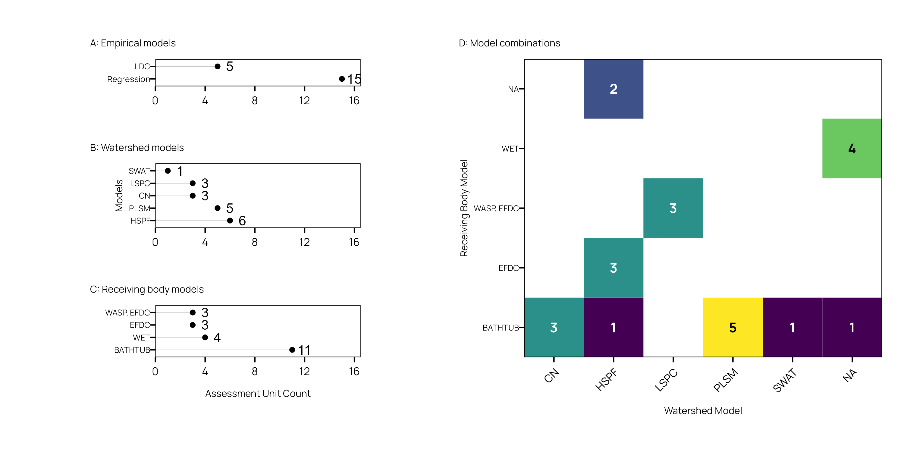

```{r setup, include=FALSE}
## load libraries
library(officer)
library(officedown)
library(flextable)
library(ragg)

library(dplyr)
library(stringr)
library(ggplot2)
library(readr)

## this sets our default code chunk options
knitr::opts_chunk$set(dev = "ragg_png",
                      echo = FALSE,
                      ## figure chunk options
                      fig.cap = TRUE,
                      fig.width = 6)

```


Texas Water Resources Institute

Texas A&M Agrilife

College Station, TX

TR-ABCD


This project was funded through a grant from a generous agency.

Insert other funding or partnership acknowledgments here.

```{r}
## leave in, starts new word document section
## after table of abbreviations
block_section(prop_section(type = "nextPage"))
```

::: {custom-style="Unnumbered Heading 1"}

Table of Contents

:::

<!---BLOCK_TOC--->

::: {custom-style="Unnumbered Heading 1"}

Table of Figures

:::

<!---BLOCK_TOC{seq_id: 'fig'}--->

::: {custom-style="Unnumbered Heading 1"}

Table of Tables

:::

<!---BLOCK_TOC{seq_id: 'tab'}--->

::: {custom-style="Unnumbered Heading 1"}

Abbreviations

:::


```{r}
## leave in, ends word document section
## after table of abbreviations
block_section(prop_section(type = "nextPage"))
```

# Headings

## Second Level Heading

### Third Level Heading

First, second, and third level headings are defined by `#`, `##`, and `###` respectively.


# Introduction

States are required to identify water bodies that do not meet designated water
uses under Section 303(d) of the Clean Water Act. Total Maximum Daily Loads (TMDLs)
must be developed for pollutants causing the impairment. TMDLs designate an
allowable daily allowable pollutant load that can be discharged to the waterbody
and continue to meet criteria for designated uses. 

# Methods


# Results


# Tables

```{r}
df <- read_csv("../../data/all_lake_tmdls_docs_edited.csv")
```


This is an example of an unformatted table and how we cross-reference that table ([Table \@ref(tab:mtcars)](#tab:mtcars)).

```{r tab.cap='this is the builtin mtcars data.', tab.id='mtcars'}
dat <- mtcars
head(dat, n = 10)
```


The [`flextable`](https://davidgohel.github.io/flextable/) package provides additional formatting flexibility when exporting to Word (Table \@ref(tab:mtcarsflex)).

```{r tab.cap='flextable formatted table.', tab.id='mtcarsflex'}
ft <- flextable(head(dat, n = 10))
ft
```


# Figures

We can embed and cross-reference plots (Figure \@ref(fig:states)).

```{r states, fig.cap=" (A) Number of Lake TMDL documents per state in EPA regions 4 and 6 (January 2020 through December 2024; (B) Distinct lake assessment units covered by TMDLs per state in EPA regions 4 and 6 (January 2020 through December 2024.", fig.alt="Alternative text for screen readers", fig.width=6, fig.height=3, fig.dpi=300}

```

```{r lakesize, fig.cap=" (A) Histogram of lake surface area (acres) and (B) histogram of lake watershed area (acres).", fig.alt="Alternative text for screen readers", fig.width=6, fig.height=3, fig.dpi=300}
knitr::include_graphics("../../figures/fig2.png")
```


```{r params, fig.cap=" (A) TMDL Allocation parameter frequency and (B) target parameter frequency.", fig.alt="Alternative text for screen readers", fig.width=6, fig.height=3, fig.dpi=300}

```


```{r}
## leave in, end word document section
## after table of abbreviations
block_section(prop_section(type = "nextPage"))
```

<!---BLOCK_LANDSCAPE_START--->


```{r models, fig.cap="Models...", fig.alt="Alternative text for screen readers", fig.width=10, fig.height=5, fig.dpi=300, out.width="100%"}

```

# Landscape Section

```{r, echo=FALSE, fig.cap='sin function', fig.id='sinus', fig.width=6, fig.height=4, fig.align='center'}
x <- seq(1,30, by = .1)
plot(x, sin(x), type = "l", main = "", xlab = "", ylab = "", col = "#CC4300")
```

<!---BLOCK_LANDSCAPE_STOP--->

```{r modparams, fig.cap="Models...", fig.alt="Alternative text for screen readers", fig.width=6, fig.height=4, fig.dpi=300}
knitr::include_graphics("../../figures/fig5.png")
```

# Math

Wrap variables or math in a single `$` to show math inline. For example, $\varepsilon \sim \mathrm{N}(0,1)$. Standalone equations are wrapped with `$$`.

$$
\left(\prod_{i=1}^{n}y_i\right)^{\frac{1}{n}} = \exp\left[\frac{1}{n}\sum_{i=1}^n\log{y_i}\right], \quad \textrm{when} \quad y_1, y_2, ..., y_n > 0
$$

If the equations need to be numbered and cross-referenced the format as:

```tex
\begin{equation}
\left(\prod_{i=1}^{n}y_i\right)^{\frac{1}{n}} = \exp\left[\frac{1}{n}\sum_{i=1}^n\log{y_i}\right], \quad \textrm{when} \quad y_1, y_2, ..., y_n > 0
(\#eq:gmean)
\end{equation}
```

Which renders as (Equation \@ref(eq:gmean):

\begin{equation}
\left(\prod_{i=1}^{n}y_i\right)^{\frac{1}{n}} = \exp\left[\frac{1}{n}\sum_{i=1}^n\log{y_i}\right], \quad \textrm{when} \quad y_1, y_2, ..., y_n > 0
(\#eq:gmean)
\end{equation}

# References

In-text references and bibliography generation are handled automatically. It relies on creating a bibtex `.bib` file with your references. Software such as Zotero, Mendely, and even Google Scholar can generate the bibtex entries for you. The entries are stored in the `bibliography.bib` file inside the same directory as this `.Rmd` file. To make a in text citation, use the following syntax, `[@helsel_statistical_2002]` to generate the reference at the end of this sentence [@helsel_statistical_2002]. Use a semicolon to include multiple references `[@helsel_statistical_2002; @hirsch2010weighted]` [@helsel_statistical_2002; @hirsch2010weighted]. Or we might use `@helsel_statistical_2002` without brackets to indicate @helsel_statistical_2002 provide a fundamental overview of water quality statistics. The bibliography will populate automatically.

# Styling and fonts

This template uses Minion Pro for body fonts and Open Sans for headings following TWRI brand guidance and AgriLife brand guidance. I can't bundle Minion Pro in this package because of licensing, but you can download and install both fonts from AgriLife (https://agrilife.tamu.edu/wp-content/uploads/2021/03/AgriFonts.zip). I recommend downloading and installing the fonts before knitting your documents. Note that Minion Pro won't "embed" in Word documents because it is an OTF style font and currently Word only embeds TTF fonts. That means collaborators without the font installed on their system will see a different serif font on their system in Word. Once exported to pdf, both OTF and TTF fonts should be embedded correctly.


# Bibliography {-}

<div id="refs"></div>

```{r}
## leave in, ends word document section
## after table of abbreviations
block_section(prop_section(type = "nextPage"))
```

# Appendix A {-}

You can add more info, tables, and figures here.

```{r}
## leave in, ends word document section
## after table of abbreviations
block_section(prop_section(type = "nextPage"))
```
